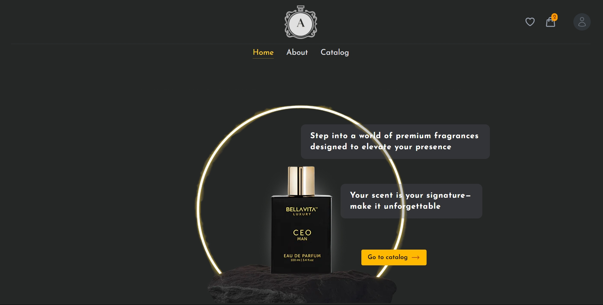
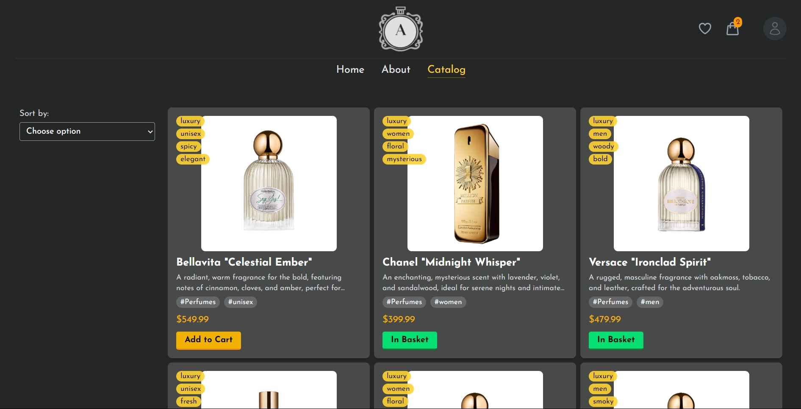

# Aroma Lux

## About The Project

Aroma Lux is an elegant landing page designed for perfume stores. It provides a sleek and modern user
experience with a focus on high-quality visuals and smooth navigation.

<div style="display: flex; flex-direction: column">


</div>

### Features

- **Modern UI with TailwindCSS**
- **State management with Pinia**
- **Routing with Vue Router**
- **Authentication via Firebase**
- **Form validation using Vee-Validate & Yup**

### Built With

The application was developed using these technologies:

* [![Vue][Vue.js]][Vue-url]
* [![TailwindCSS][Tailwindcss]][Tailwind-url]
* [![Pinia][Pinia.js]][Pinia-url]
* [![Firebase][Firebase]][Firebase-url]
* [![Vue Router][Vue-router]][Vue-router]
* [![VeeValidate][VeeValidate]][VeeValidate-url]
* [![Yup][Yup]][Yup-url]

## Getting Started

Follow the steps below to install and run the project locally.

### Requirements

Ensure your environment meets the following requirements:

- Node.js >= 21.x
- NPM >= 9.x

### Installation

1. Clone the repository:

   ```bash
   git clone https://github.com/LashkayDaniel/aroma-lux.git
   ```

2. Navigate to the project directory:

   ```bash
   cd aroma-lux
   ```

3. Install dependencies:

   ```bash
   npm install
   ```

4. Set up Firebase environment variables:

   Create a `.env` file in the root directory and add the following:

   ```env
   VITE_FIREBASE_API_KEY=your_api_key
   VITE_FIREBASE_AUTH_DOMAIN=your_auth_domain
   VITE_FIREBASE_PROJECT_ID=your_project_id
   VITE_FIREBASE_STORAGE_BUCKET=your_storage_bucket
   VITE_FIREBASE_MESSAGING_SENDER_ID=your_messaging_sender_id
   VITE_FIREBASE_APP_ID=your_app_id
   ```

   Replace `your_*` values with your actual Firebase project credentials.

5. Start the development server:

   ```bash
   npm run dev
   ```

6. Open your browser and go to `http://localhost:5173`.

[Vue.js]: https://img.shields.io/badge/Vue.js-35495E?style=for-the-badge&logo=vuedotjs&logoColor=4FC08D

[Vue-url]: https://vuejs.org/

[Pinia.js]: https://img.shields.io/badge/Pinia-FFD700?style=for-the-badge&logo=pinia&logoColor=black

[Pinia-url]: https://pinia.vuejs.org/

[Tailwindcss]: https://img.shields.io/badge/TailwindCSS-00BCFF?style=for-the-badge&logo=tailwindcss&logoColor=white

[Tailwind-url]: https://tailwindcss.com/

[Firebase]: https://img.shields.io/badge/Firebase-d93814?style=for-the-badge&logo=firebase&logoColor=black

[Firebase-url]: https://firebase.google.com/

[VeeValidate]: https://img.shields.io/badge/Vee--Validate-4FC08D?style=for-the-badge&logo=vuedotjs&logoColor=white

[VeeValidate-url]: https://vee-validate.logaretm.com/

[Yup]: https://img.shields.io/badge/Yup-4169E1?style=for-the-badge&logoColor=white

[Yup-url]: https://github.com/jquense/yup

[Vue-router]: https://img.shields.io/badge/Vue--Router-e8e04f?style=for-the-badge&logo=vue.js&logoColor=26a637

[Vue-router-url]: https://router.vuejs.org/